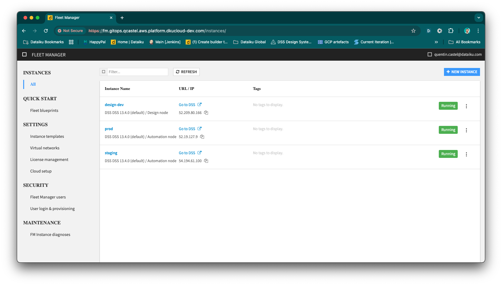

# Implementing GitOps for Dataiku: A Success Story

## Introduction

In the world of software development, GitOps has become a buzzword, promising streamlined deployments and enhanced collaboration.
But what does GitOps look like in action, especially for Dataiku projects?
In this article, we'll walk you through a practical Proof of Concept (POC) that demonstrates how to implement GitOps for Dataiku.
Inspired by System1's successful deployment, this guide invites you to try it yourself using shared resources.

## What is GitOps?

At its core, GitOps uses Git as the single source of truth for managing infrastructure and application deployments. By leveraging Git's version control capabilities, GitOps ensures that your system's desired state is always reflected in your Git repository, enabling automated deployments and rollbacks.

## System1's Experience with GitOps

System1, a valued customer of Dataiku, has successfully implemented a GitOps workflow for their Dataiku projects. Their experience demonstrates the real-world benefits of adopting GitOps for data science workflows.

> _"Integrating GitOps with our Dataiku projects has significantly improved our deployment process by adding automation, consistency, and control. Using GitHub Actions and Pulumi, we built a CI/CD pipeline that automates testing, can enforce mandatory reviews, and ensures only validated changes are deployed. This approach not only strengthens access control but also provides seamless rollbacks if issues arise. Now, every change is tested and reviewed before moving from development to staging and production, which can give us confidence in our deployments, improves overall collaboration across teams and also provides more visibility, because we can see the git diff in the pull request."_  
> — Attila Nagy, Sr. DataOps Engineer at System1

## How GitOps Works with Dataiku

The GitOps implementation for Dataiku creates a seamless workflow across development, staging, and production environments. Here's a high-level overview of how it works:

1. **Development**: Data scientists work in their familiar Dataiku environment
2. **Version Control**: Changes are automatically tracked in Git
3. **Automated Testing**: Pull requests trigger automated tests
4. **Controlled Deployment**: Approved changes are automatically deployed to production

## Benefits for Organizations

Organizations implementing GitOps for Dataiku have seen several key benefits:

- **Consistency and Reliability**: Every change follows the same tested, automated path to production
- **Enhanced Collaboration**: Team members can review changes through pull requests
- **Automated Rollbacks**: If issues arise, systems can automatically revert to previous working states
- **Audit Trail**: All changes are tracked and documented in Git

## Getting Started

Ready to implement GitOps for your Dataiku projects? We've created a detailed technical guide that walks through the complete implementation process, including:

- Setting up Git integration with Dataiku
- Configuring automated testing
- Implementing secure deployment pipelines
- Managing multiple projects at scale

And for organizations looking to scale their implementation, System1 shares additional insights on automation:

> "Managing multiple Dataiku projects manually became challenging as we scaled. We automated our entire setup using Pulumi to manage GitHub repositories and their configurations. Our automated process discovers Dataiku resources (projects, plugins), creates corresponding GitHub repositories, and maintains all necessary settings and secrets. It even handles cleanup by removing repositories when projects are deleted. This has significantly reduced our operational overhead and potential for configuration errors."
> — Attila Nagy, Sr. DataOps Engineer at System1

➡️ [View the Complete Technical Implementation Guide](link-to-developer-guide)

## Conclusion

GitOps brings software development best practices to the world of data science, helping organizations manage their Dataiku deployments more effectively. Whether you're looking to improve collaboration, enhance reliability, or streamline deployments, GitOps offers a proven approach that can transform how you manage your Dataiku projects.
