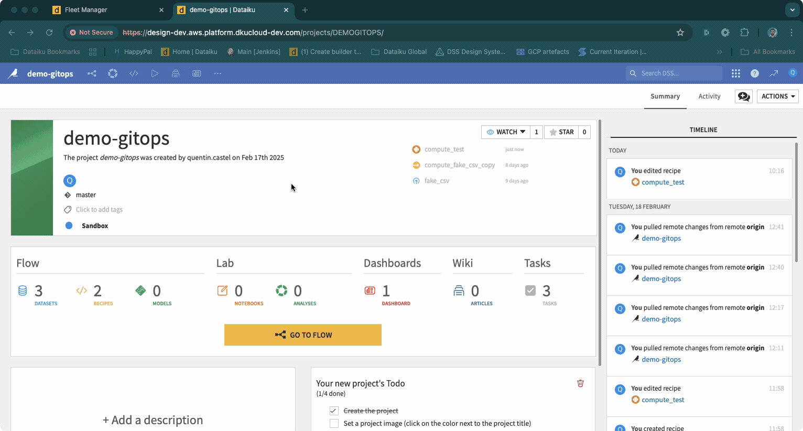
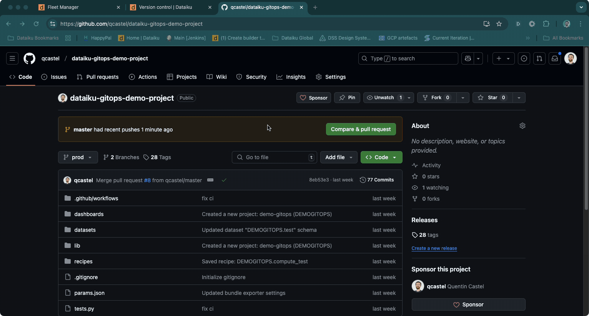

# Implementing GitOps for Dataiku: A Hands-On Guide

## Introduction

In the world of software development, GitOps has become a buzzword, promising streamlined deployments and enhanced collaboration.
But what does GitOps look like in action, especially for Dataiku projects?
In this article, we'll walk you through a practical Proof of Concept (POC) that demonstrates how to implement GitOps for Dataiku.
Inspired by System1's successful deployment, this guide invites you to try it yourself using shared resources.

Note: This implementation specifically demonstrates GitOps using GitHub as the platform. While GitOps principles can be implemented using other Git platforms (such as GitLab or Bitbucket), this guide focuses on GitHub-specific features like GitHub Actions for the CI/CD pipeline. The core concepts remain applicable to other platforms, though the specific implementation details may vary.

## What is GitOps?

Before diving into the POC, let's briefly touch on GitOps. At its core, GitOps uses Git as the single source of truth for managing infrastructure and application deployments.
By leveraging Git's version control capabilities, GitOps ensures that your system's desired state is always reflected in your Git repository, enabling automated deployments
and rollbacks.

## System1's Experience with GitOps

System1, a valued customer of Dataiku, has successfully implemented a GitOps workflow for their Dataiku projects. Their experience has been instrumental in shaping this POC,
providing real-world insights into the benefits and challenges of adopting GitOps.

### System1's Testimony

> _"Integrating GitOps with our Dataiku projects has significantly improved our deployment process by adding automation, consistency, and control. Using GitHub Actions and Pulumi, we built a CI/CD pipeline that automates testing, can enforce mandatory reviews, and ensures only validated changes are deployed. This approach not only strengthens access control but also provides seamless rollbacks if issues arise. Now, every change is tested and reviewed before moving from development to staging and production, which can give us confidence in our deployments, improves overall collaboration across teams and also provides more visibility, because we can see the git diff in the pull request."_  
> — [Attila Nagy], [Sr. DataOps Engineer] at System1

## The Proof of Concept (POC)

This POC demonstrates how to implement GitOps for Dataiku using three environments: development (dev), staging, and production (prod). The goal is to push a project from dev
to prod through a series of automated steps, with Git serving as the single source of truth to ensure consistency and reliability across environments.


## Step-by-Step Guide to Implementing GitOps for Dataiku

### 1. Setting Up Git Remote for Dataiku DSS

In Dataiku DSS, every project is inherently a Git project. Within the "Version Control" section, you can access all the typical features of a Git repository, such as commit
history, revert options, and branch management. This is where you can set up a remote repository, which is essential for implementing GitOps.

To set up a Git remote to a GitHub project, follow these steps:

- **Navigate to Version Control**: In your Dataiku DSS project, go to the "Version Control" section.
- **Set Remote Repository**: Click on "Set Remote" and enter the URL of your GitHub repository.
- **Push Changes**: Once the remote is set, you can push your changes to the remote repository.



#### Integrating GitOps into Your Existing Workflow

As a Dataiku user, your daily workflow remains largely unchanged. You continue to develop and refine your projects within the DSS environment, leveraging its powerful tools
and features. However, when you're ready to push your changes to production, that's where the GitOps workflow begins to enhance your process:

- **Continue Your Usual Development**: Work on your Dataiku projects as you always have, making changes, running experiments, and iterating on your models.
- **Initiate the GitOps Workflow**: When you're ready to move your changes to production, push your changes to the remote repository. This is the starting point of the GitOps
  workflow.

This approach allows you to build on your existing workflow, adding the benefits of GitOps without disrupting your current processes. It provides a structured path to
production, enhancing reliability and collaboration.

#### Transitioning to a Classic Git Workflow

Once your changes are pushed to your branch in GitHub, you enter a more traditional Git workflow. Here's how it unfolds:

- **Branch Management**: Typically, you work on a feature or fix in a dedicated branch, such as 'dev' for our POC. This allows you to isolate your
  changes and work independently from the main production code. Once your work is complete, push your changes to the corresponding branch in the remote
  repository, ensuring they are safely stored and ready for review.
- **Create a Pull Request (PR)**: With your changes in your branch, the next step is to create a PR. This PR is a request to merge your changes from the
  development branch to
  the production branch (`prod`). It acts as a gatekeeper, ensuring that only tested and approved changes make it to production.

### 2. Create a Pull Request (PR)

You can configure the pull request process to suit your needs, setting specific rules such as required approvers, mandatory tests, and more.
For this POC, we have added a test suite to validate that the changes are valid before allowing them to be merged. This ensures that only tested and approved
changes make it to production, maintaining the integrity and stability of your production environment.



To illustrate the importance of automated testing in our GitOps workflow, let's look at an example where a change introduces a breaking issue. The following gif demonstrates how our CI/CD pipeline detects the problem, preventing the faulty code from being merged into the production branch. This ensures that only stable and tested code is deployed, maintaining the integrity of our production environment.


### 3. GitHub Actions for CI/CD

When a PR is created, a CI process is automatically triggered because we have set up our CI specifically for this POC. We are using a custom GitHub Action
created specifically for this purpose, which you can find [here](#). Our PR
CI workflow is defined in the `pr.yml` file:

```yaml
name: Dataiku GitOps PR

on:
pull_request:
branches: - prod

jobs:
run-tests:
runs-on: ubuntu-latest

    steps:
      - name: Checkout code
        uses: actions/checkout@v2

      - name: Run Dataiku GitOps Action
        uses: qcastel/dataiku-gitops-github-action@master
        with:
          python-script: "tests.py"
          dataiku_api_token_dev: ${{ secrets.DATAIKU_INSTANCE_DEV_CI_API_TOKEN }}
          dataiku_api_token_staging: ${{ secrets.DATAIKU_INSTANCE_STAGING_CI_API_TOKEN }}
          dataiku_api_token_prod: ${{ secrets.DATAIKU_INSTANCE_PROD_CI_API_TOKEN }}
          dataiku_instance_dev_url: ${{ vars.DATAIKU_INSTANCE_DEV_URL }}
          dataiku_instance_staging_url: ${{ vars.DATAIKU_INSTANCE_STAGING_URL }}
          dataiku_instance_prod_url: ${{ vars.DATAIKU_INSTANCE_PROD_URL }}
          dataiku_project_key: ${{ vars.DATAIKU_PROJECT_KEY }}
          run_tests_only: "true"
```

The `pr.yml` file is triggered when a PR is created. It will run the `run_tests` function in `tests.py`, which will create a bundle from the DSS Dev instance, push it to the
Staging environment, and run the tests. You can find more details about the github actions [here](#).

To consume the GitHub Action, you will notice that we are passing it a tests script which we will detail in the next section. We also define some secrets and variables that
are used to configure the GitHub Action, those are the different urls and API keys to access the different environments.

### Dataiku GitOps GitHub Action

GitHub Actions are workflows that automate tasks within your software development lifecycle.
The Dataiku GitOps GitHub Action is a simple wrapper around the `dataiku_gitops_action.py` script.
This action automates the process of creating and managing bundles in Dataiku, ensuring a seamless transition from development to production.

```python
# Content of dataiku_gitops_action.py

def main():
    try:
        # Get the current commit ID
        commit_id = get_commit_id()
        bundle_id = generate_bundle_id(commit_id)
        release_notes = "Initial release"  # Optional release notes

        # Export bundle from DEV instance
        export_bundle(client_dev, DATAIKU_PROJECT_KEY, bundle_id, release_notes)
        print(f"Bundle exported with ID: {bundle_id}")

        # Download the exported bundle
        download_path = 'bundle.zip'
        download_export(client_dev, DATAIKU_PROJECT_KEY, bundle_id, download_path)
        print("Bundle downloaded.")

        # List imported bundles in Staging instance before activation
        imported_bundles_staging = list_imported_bundles(client_staging, DATAIKU_PROJECT_KEY)
        previous_bundle_id_staging = max(imported_bundles_staging['bundles'], key=lambda bundle: datetime.strptime(bundle['importState']['importedOn'], '%Y-%m-%dT%H:%M:%S.%f%z'))['bundleId']

        # Import bundle into Staging instance
        import_bundle(client_staging, bundle_id, DATAIKU_PROJECT_KEY, download_path)
        print(f"Bundle imported with ID: {bundle_id}")

        activate_bundle(client_staging, DATAIKU_PROJECT_KEY, bundle_id)
        print(f"Bundle activated with ID: {bundle_id}")

        # Run tests on Staging instance
        if run_tests(PYTHON_SCRIPT, DATAIKU_INSTANCE_STAGING_URL, DATAIKU_API_TOKEN_STAGING, DATAIKU_PROJECT_KEY):

            if RUN_TESTS_ONLY:
                print("Tests passed in staging. Skipping deployment to production.")
            else:
                print("Tests passed in staging. Deploying to production.")

                # List imported bundles in Prod instance before activation
                imported_bundles_prod = list_imported_bundles(client_prod, DATAIKU_PROJECT_KEY)
                previous_bundle_id_prod = max(imported_bundles_prod['bundles'], key=lambda bundle: datetime.strptime(bundle['importState']['importedOn'], '%Y-%m-%dT%H:%M:%S.%f%z'))['bundleId']

                # Import bundle into Prod instance
                import_bundle(client_prod, bundle_id, DATAIKU_PROJECT_KEY, download_path)
                print(f"Bundle imported with ID: {bundle_id}")

                # Activate bundle in Prod instance
                activate_bundle(client_prod, DATAIKU_PROJECT_KEY, bundle_id)
                print(f"Bundle activated with ID: {bundle_id}")

                # Run tests on Prod instance
                if run_tests(PYTHON_SCRIPT, DATAIKU_INSTANCE_PROD_URL, DATAIKU_API_TOKEN_PROD, DATAIKU_PROJECT_KEY):
                    print("Deployment and tests successful in production.")
                else:
                    print("Tests failed in production. Activating previous bundle.")
                    activate_bundle(client_prod, DATAIKU_PROJECT_KEY, previous_bundle_id_prod)
                    print(f"Previous bundle activated with ID: {previous_bundle_id_prod}")
                    sys.exit(1)
        else:
            print("Tests failed in staging. Activating previous bundle.")
            activate_bundle(client_staging, DATAIKU_PROJECT_KEY, previous_bundle_id_staging)
            print(f"Previous bundle activated with ID: {previous_bundle_id_staging}")
            sys.exit(1)
```

#### How It Works

- **Create a Bundle from the DSS Dev Instance**: The action begins by creating a bundle from your development instance in Dataiku DSS.
- **Push the Bundle to Staging**: The bundle is then pushed to the staging environment, preparing it for testing.
- **Run a Set of Tests**: The `run_tests` function in `tests.py` is executed to ensure that the recipe runs successfully. This script is defined in each project repository and is tailored to the specific requirements and functionalities of the project. Here's a snippet of the function we used for our POC:

```python
def run_tests(instance_url, api_key, project_key):
    client = DSSClient(instance_url, api_key, no_check_certificate=True)
    project = client.get_project(project_key)
    recipe = project.get_recipe('compute_test')
    try:
        recipe.run(wait=True, no_fail=False)
        return 'SUCCESS'
    except Exception as e:
        print(f"An error occurred while running the job: {e}")
        return 'FAILED'
```

If the tests are successful, the PR is marked green, indicating that it is ready to be merged. If any tests fail, the PR is marked red, preventing it from being merged
until the issues are resolved.

#### Reusing GitHub Actions

The GitHub Action used in this article is available for you to reuse and test the concept of GitOps with Dataiku. While Dataiku may not officially support this action,
it is offered under the Apache 2.0 license, allowing for contributions and modifications. This flexibility enables you to adapt the workflow to your specific needs and collaborate with others in the community.

### 4. Merge and Deploy

Once the PR is marked as green, indicating that all tests have passed, it can be merged into the `prod` branch. This triggers the CI/CD pipeline to replay the tests and
deploy the changes to the production environment. If, for any reason, the bundle pushed to production is broken and the tests fail, the CI will immediately revert to the
previous bundle and highlight the release as failed. This ensures that the production environment remains stable and reliable.

The `release.yml` file is used for this process:

```yaml
name: Dataiku GitOps Release

on:
  push:
    branches:
      - prod

jobs:
  deploy:
    runs-on: ubuntu-latest

    steps:
      - name: Checkout code
        uses: actions/checkout@v2

      - name: Run Dataiku GitOps Action
        uses: qcastel/dataiku-gitops-github-action@master
        with:
          python-script: "tests.py"
          dataiku_api_token_dev: ${{ secrets.DATAIKU_INSTANCE_DEV_CI_API_TOKEN }}
          dataiku_api_token_staging: ${{ secrets.DATAIKU_INSTANCE_STAGING_CI_API_TOKEN }}
          dataiku_api_token_prod: ${{ secrets.DATAIKU_INSTANCE_PROD_CI_API_TOKEN }}
          dataiku_instance_dev_url: ${{ vars.DATAIKU_INSTANCE_DEV_URL }}
          dataiku_instance_staging_url: ${{ vars.DATAIKU_INSTANCE_STAGING_URL }}
          dataiku_instance_prod_url: ${{ vars.DATAIKU_INSTANCE_PROD_URL }}
          dataiku_project_key: ${{ vars.DATAIKU_PROJECT_KEY }}
          run_tests_only: "false"
```

This workflow reuses the same GitHub Action, but this time it also pushes the changes to production. It's a great demonstration of how GitHub Actions are reusable across
different workflows.


While we've demonstrated this process for a single project, many customers will have multiple projects to manage. To extend this approach across various projects, you can:

- Copy and paste the CI/CD configuration for each new project.
- Reuse the same GitHub Action, ensuring consistency and efficiency across your workflows.
- Customize a `tests.py` script for each project to validate that your specific project requirements are met and everything is functioning as expected.

## Try It Yourself

We invite you to try this POC yourself! The assets used for this POC, including the project repository and GitHub Action repository, are shared and linked below:

- [Project Repository](https://github.com/qcastel/dataiku-gitops-demo-project) (Link to your project repository)
- [GitHub Action Repository](https://github.com/qcastel/dataiku-gitops-github-action) (Link to your GitHub Action repository)

## Benefits of Using GitOps for Dataiku

- **Consistency and Reliability**: By using Git as the single source of truth, GitOps ensures that deployments are consistent and reliable across environments.

- **Automated Rollbacks**: In case of a failure, GitOps allows for easy rollbacks to the last known good state, minimizing downtime and reducing the risk of errors.

- **Enhanced Collaboration**: The use of PRs and GitHub Actions fosters collaboration among team members, as changes are reviewed and tested before being deployed.

## Drawbacks of Using GitOps for Dataiku

- **Complexity**: Setting up a GitOps workflow can be complex, especially for teams unfamiliar with Git and CI/CD pipelines.

- **Learning Curve**: There is a learning curve associated with adopting GitOps, as it requires a shift in mindset from traditional deployment methods.

## Conclusion

Implementing GitOps for Dataiku can significantly enhance your deployment process, providing consistency, reliability, and collaboration. By leveraging the power of Git
and GitHub Actions, you can automate your CI/CD pipeline and ensure that your Dataiku projects are always in a deployable state. Whether you're just getting started or
looking to refine your existing workflow, GitOps offers a robust framework for managing your Dataiku deployments.
