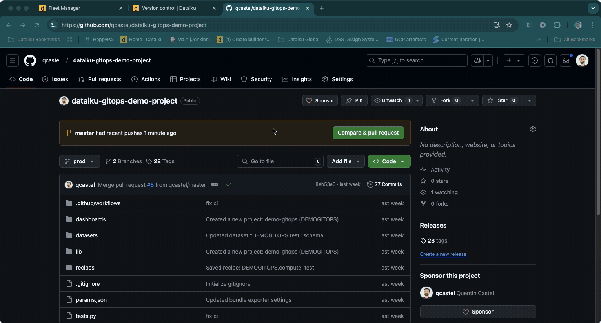

# Implementing GitOps for Dataiku: Technical Guide

## Overview

GitOps applies DevOps best practices to infrastructure automation, using Git as the single source of truth for declarative infrastructure and applications. For Dataiku deployments, this means:

- Version control of Dataiku projects
- Automated testing and validation
- Controlled promotions across environments
- Automated rollbacks on failure

This guide demonstrates a PoC implementation of GitOps for Dataiku using GitHub Actions. While this implementation is experimental and not officially supported by Dataiku, it provides a practical example of how to set up automated deployment pipelines across development, staging, and production environments. The goal is to showcase the potential of GitOps for Dataiku projects while acknowledging that production implementations may require additional considerations and customizations.


While GitOps principles can be implemented using various Git platforms (such as GitLab or Bitbucket), this PoC specifically uses GitHub features like GitHub Actions for the CI/CD pipeline.

### 1. Setting Up Git Remote for Dataiku

In Dataiku, every project is inherently a Git project. Within the "Version Control" section, you can access all the typical features of a Git repository, such as commit
history, revert options, and branch management. This is where you can set up a remote repository, which is essential for implementing GitOps.

To set up a Git remote to a GitHub project, follow these steps:

- **Navigate to Version Control**: In your Dataiku project, go to the "Version Control" section.
- **Set Remote Repository**: Click on "Set Remote" and enter the URL of your GitHub repository.
- **Push Changes**: Once the remote is set, you can push your changes to the remote repository.


#### Integrating GitOps into Your Existing Workflow

As a Dataiku user, your daily workflow remains largely unchanged. You continue to develop and refine your projects within the Dataiku environment, leveraging its powerful tools
and features. When you're ready to promote your changes to production, simply push them to the remote repository to initiate the GitOps workflow. This approach adds deployment controls and automation without disrupting your familiar development process.

#### Transitioning to a Classic Git Workflow

Once your changes are pushed to your branch in GitHub, you enter a more traditional Git workflow. Here's how it unfolds:

- **Branch Management**: Typically, you work on a feature or fix in a dedicated branch, such as 'dev' for our POC. This allows you to isolate your
  changes and work independently from the main production code. Once your work is complete, push your changes to the corresponding branch in the remote
  repository, ensuring they are safely stored and ready for review.
- **Create a Pull Request (PR)**: With your changes in your branch, the next step is to create a PR. This PR is a request to merge your changes from the
  development branch to
  the production branch (`prod`). It acts as a gatekeeper, ensuring that only tested and approved changes make it to production.

### 2. Create a Pull Request (PR)

You can configure the pull request process to suit your needs, setting specific rules such as required approvers, mandatory tests, and more.
For this POC, we have added a test suite to validate that the changes are valid before allowing them to be merged. This ensures that only tested and approved
changes make it to production, maintaining the integrity and stability of your production environment.



To illustrate the importance of automated testing in our GitOps workflow, let's look at an example where a change introduces a breaking issue. The following gif demonstrates how our CI/CD pipeline detects the problem, preventing the faulty code from being merged into the production branch. This ensures that only stable and tested code is deployed, maintaining the integrity of our production environment.


### 3. GitHub Actions for CI/CD

When a PR is created, a CI process is automatically triggered because we have set up our CI specifically for this POC. We are using a custom GitHub Action
created specifically for this purpose, which you can find [here](https://github.com/qcastel/dataiku-gitops-demo-project). Our PR
CI workflow is defined in the [pr.yml](https://github.com/qcastel/dataiku-gitops-demo-project/blob/prod/.github/workflows/pr.yml) file:

```yaml
name: Dataiku GitOps PR

on:
  pull_request:
    branches:
      - prod

jobs:
  run-tests:
    runs-on: ubuntu-latest

    steps:
      - name: Checkout code
        uses: actions/checkout@v2

      - name: Run Dataiku GitOps Action
        uses: qcastel/dataiku-gitops-github-action@master
        with:
          python-script: "tests.py"
          dataiku_api_token_dev: ${{ secrets.DATAIKU_INSTANCE_DEV_CI_API_TOKEN }}
          dataiku_api_token_staging: ${{ secrets.DATAIKU_INSTANCE_STAGING_CI_API_TOKEN }}
          dataiku_api_token_prod: ${{ secrets.DATAIKU_INSTANCE_PROD_CI_API_TOKEN }}
          dataiku_instance_dev_url: ${{ vars.DATAIKU_INSTANCE_DEV_URL }}
          dataiku_instance_staging_url: ${{ vars.DATAIKU_INSTANCE_STAGING_URL }}
          dataiku_instance_prod_url: ${{ vars.DATAIKU_INSTANCE_PROD_URL }}
          dataiku_project_key: ${{ vars.DATAIKU_PROJECT_KEY }}
          client_certificate: ${{ secrets.CLIENT_CERTIFICATE }}
          run_tests_only: "true"
```

The `pr.yml` file is triggered when a PR is created. It will create a bundle from the Dataiku Dev instance, push it to the Staging environment, and run the tests. You can find more details about the github actions [here](https://github.com/qcastel/dataiku-gitops-github-action).

To consume the GitHub Action, you will notice that we are passing it a tests script which we will detail in the next section. We also define some secrets and variables that
are used to configure the GitHub Action, those are the different urls and API keys to access the different environments.

### Dataiku GitOps GitHub Action

GitHub Actions are workflows that automate tasks within your software development lifecycle.
The Dataiku GitOps GitHub Action is a simple wrapper around the `dataiku_gitops_action.py` script.
This action automates the process of creating and managing bundles in Dataiku, ensuring a seamless transition from development to production.

An important note about GitOps implementation with Dataiku: While GitOps traditionally uses Git as the single source of truth, in this setup, the deployed bundle might not exactly match the Git repository state. This occurs because the bundle is created at a specific point in time when GitHub Actions runs, and the Dataiku state could be newer than the Git state. To address this, our implementation includes a synchronization check that:

1. Retrieves the latest commit SHA from Dataiku
2. Compares it with the GitHub repository state
3. If they don't match, triggers a Git push from the Dataiku side and restarts the process

This ensures consistency between your Git repository and Dataiku state.

```python
# Content of dataiku_gitops_action.py
def deploy(infra_id):
    """Deploy to production using bundle and deployer."""
    try:
        commit_id = get_git_sha()
        bundle_id = generate_bundle_id(commit_id)
        project = client_dev.get_project(DATAIKU_PROJECT_KEY)
        project.export_bundle(bundle_id)

        # Publish the bundle to the deployer
        project.publish_bundle(bundle_id)

        # Get the deployer from the client and deploy
        deployer = client_dev.get_projectdeployer()
        deployment = deployer.create_deployment(
            deployment_id=f"deploy_{bundle_id}",
            project_key=DATAIKU_PROJECT_KEY,
            infra_id=infra_id,
            bundle_id=bundle_id
        )
        update = deployment.start_update()
        update.wait_for_result()

        print(f"Successfully deployed bundle {bundle_id} to infra {infra_id}")

    except Exception as e:
        print(f"Failed to deploy: {str(e)}")
        raise e

def main():
    try:
        dataiku_sha = get_dataiku_latest_commit(client_dev, DATAIKU_PROJECT_KEY)
        git_sha = get_git_sha()
        if dataiku_sha != git_sha:
            print(f"Dataiku commit SHA ({dataiku_sha}) doesn't match Git SHA ({git_sha})")
            sync_dataiku_to_git(client_dev, DATAIKU_PROJECT_KEY)
            print("Pushed Dataiku changes to Git. Restarting process.")
            sys.exit(0)

        deploy(DATAIKU_INFRA_ID_STAGING)

        # Run tests on Staging instance
        if run_tests(PYTHON_SCRIPT, DATAIKU_INSTANCE_STAGING_URL, DATAIKU_API_TOKEN_STAGING, DATAIKU_PROJECT_KEY):
            if RUN_TESTS_ONLY:
                print("Tests passed in staging. Skipping deployment to production.")
            else:
                print("Tests passed in staging. Deploying to production.")

                # Replace bundle import/export with deployment
                deploy(DATAIKU_INFRA_ID_PROD)

                # Run tests on Prod instance
                if run_tests(PYTHON_SCRIPT, DATAIKU_INSTANCE_PROD_URL, DATAIKU_API_TOKEN_PROD, DATAIKU_PROJECT_KEY):
                    print("Deployment and tests successful in production.")
                else:
                    print("Tests failed in production.")
                    # Note: With this approach, rollback needs to be handled through Dataiku's deployment feature
                    sys.exit(1)
        else:
            print("Tests failed in staging.")
            sys.exit(1)
```

#### Reusing GitHub Actions

The GitHub Action used in this article is available for you to reuse and test the concept of GitOps with Dataiku. While Dataiku may not officially support this action,
it is offered under the Apache 2.0 license, allowing for contributions and modifications. This flexibility enables you to adapt the workflow to your specific needs and collaborate with others in the community.

#### Testing Framework

Each Dataiku project repository contains its own test suite in `tests.py`, while the GitHub Action serves as a shared CI component that executes these project-specific tests. This separation allows teams to define tests that are relevant to their specific project's requirements while reusing the common deployment infrastructure.

For this POC, we've implemented a simple test suite using pytest. While this is a basic example for demonstration purposes, it shows how to structure tests for a Dataiku project:

> **Note on Dataiku Test Scenarios**: While we're using a simple pytest approach in this POC, Dataiku provides a powerful built-in test scenarios feature that can be integrated into deployment pipelines. Test scenarios allow you to:
>
> - Test Flow execution with reference datasets
> - Run Python unit tests directly within Dataiku
> - Test web apps
> - Automate test execution via pre/post-deployment hooks
> - View test results in a dedicated dashboard
>
> For production implementations, consider leveraging Dataiku's native test scenarios feature as described in the [Dataiku Documentation](https://knowledge.dataiku.com/latest/mlops-o16n/test-scenarios/basics/tutorial-index.html).

```python
import os

import pytest
import urllib3
from dataikuapi import DataikuClient

# Environment variables
DATAIKU_INSTANCE_URL = os.getenv('DATAIKU_INSTANCE_URL')
DATAIKU_API_KEY = os.getenv('DATAIKU_API_KEY')
DATAIKU_PROJECT_KEY = os.getenv('DATAIKU_PROJECT_KEY')

# Disable warnings for unverified HTTPS requests
urllib3.disable_warnings(urllib3.exceptions.InsecureRequestWarning)

# Fixture for the Dataiku client
@pytest.fixture
def Dataiku_client():
    return DataikuClient(DATAIKU_INSTANCE_URL, DATAIKU_API_KEY, no_check_certificate=True)

# Fixture for the project
@pytest.fixture
def project(Dataiku_client):
    return Dataiku_client.get_project(DATAIKU_PROJECT_KEY)

def test_compute_recipe(project):
    """Test that the compute_test recipe runs successfully"""
    recipe = project.get_recipe('compute_test')
    try:
        recipe.run(wait=True, no_fail=False)
        assert True
    except Exception as e:
        pytest.fail(f"Recipe execution failed: {e}")
```

The GitHub Action will execute these project-specific tests during the deployment process, ensuring that your project's unique requirements are met before proceeding with deployment.

#### Infrastructure Considerations

Since Dataiku often runs in private networks (intranets), accessing it from GitHub Actions runners requires careful security configuration. For secure communication, you can use mTLS with AWS Load Balancers. Starting from Dataiku 13.5, mTLS is officially supported in the SDK:

```python
import dataikuapi

# Initialize client with mTLS certificate
client_dev = dataikuapi.DataikuClient(
    DATAIKU_INSTANCE_DEV_URL,
    DATAIKU_API_TOKEN_DEV,
    no_check_certificate=True,
    client_certificate=certificate_path
)
```
